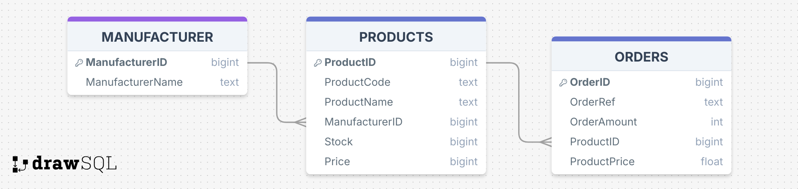

# COMPUTER WORLD - API
Computer World is a restul-ful API that stores data on Manufacturers, Products those Manufacturers provide, and the orders that are created by users.

### HOW TO USE
After cloning the repository. Open it up using GOLAND. Open the project and insert the following commands in the terminal.
 - go build
 - go run ComputerWorld_API;
 - I recommend using POSTMAN to test the API or visit: http://localhost:5000/

## DATABASE
The Computer World - API currently uses two databases. One of them labled computer_world.db. This one is the primary (currently local) database that will be used. The other being computer_world_test.db, this is used in conjuction with the tests only and help find flaws in the code.

### TABLES

## TO-DO
- More tests need to be implemented to discover the flaws in the code and prevent problems in the future.
- Refactor the code more and reduce the usage of global variables.
- Create the front-end of the API to start displaying information and storing it in the database.
